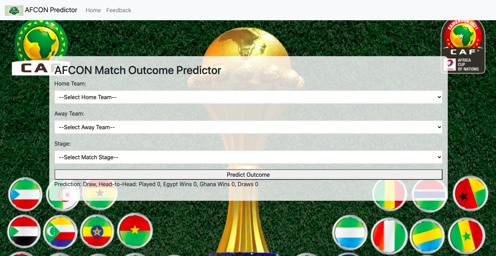

## AFCON Match Outcome Predictor

This application predicts the outcome of Africa Cup of Nations (AFCON) matches using a machine learning model. It's built with a Python with flask for easy interaction.

**Features**
<ul>
<li>Predict match outcomes (win, lose, draw) based on teams and match stage.</li>
<li>Simple and user-friendly interface.</li>
</ul>

**Prerequisites**

To run this application, you need:
<ul>
<li>Python 3.x</li>
<li>Fassk (usually comes pre-installed with Python)</li>
<li>joblib</li>
</ul>

**Installation and Usage**
<ul>
<li>Clone or download this repository to your local machine.</li>
<li>Ensure Python 3.x is installed.</li>
<li>Navigate to the application's directory.</li>
<li>To run the application script, type python afcon_predictor.py</li>
<li>Navigate to http://localhost:5000/ in your web browser to access the user interface</li>
<li>Enter the details of the match (home team, away team, and stage) in the respective fields.</li>
<li>Click the 'Predict Outcome' button to see the prediction.</li>
</ul>

However, the application can be accesed through https://matchpredictor.pythonanywhere.com/

**Model Information**

The application uses a pre-trained Random Forest Classifier model. The model is trained on historical AFCON match data and predicts one of three outcomes: Home Team Wins, Away Team Wins, or Draw.

**Customization**
<ul>
<li>The model can be retrained and updated as needed.</li>
<li>The GUI can be modified for additional features or aesthetic changes.</li>
</ul>

**License**

This project is open-source and available under the MIT License.

**Acknowledgements/Limitation**
This project was built using data from the Africa Cup of Nations and is intended for educational purposes. The prediction may not be accurate as a result of the limited data available for the model training.

**AUTHOR**

# These individuals contributed to the hbnb project in this repository 
Ese Amadasun <amadasunese@gmail.com>
